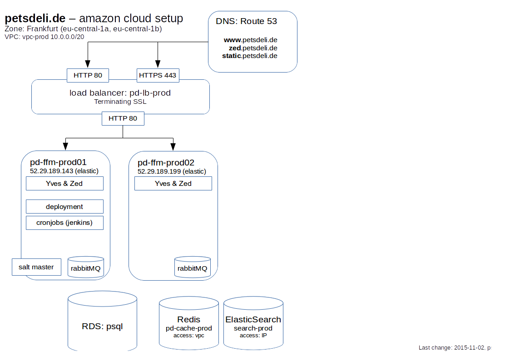

# AWS Setup

## Overview




## Servers

Our servers are located in the region **EU (Frankfurt)**.

Virtual Private Cloud: vpc-prod (vpc-503db539) `10.0.0.0/20`

```
subnet-7fb22816 (10.0.0.0/24) | subnet-prod-1a
subnet-ce9129b5 (10.0.1.0/24) | subnet-prod-1b
```


Servers are behind a load balancer (`pd-lb-prod-1685302463.eu-central-1.elb.amazonaws.com`), which terminates SSL.


Currently, all servers have ElasticIPs assigned:

```
52.29.54.163    pd-ffm-staging01
52.29.174.164   pd-ffm-staging02

52.29.189.143   pd-ffm-prod01       # also: deployment, cronjobs, salt-master
52.29.189.199   pd-ffm-prod02
```


**Add a new Server:**

* Chose community AMI: `debian-wheezy-amd64-hvm-2015-01-28-ebs (ami-98043785)`
* .. TODO


## Database


`production.c6decsyzcyxo.eu-central-1.rds.amazonaws.com` 


To connect, use a tunnel through one of our servers, or use the command line on `prod01`:

```
createdb -U production -h production.c6decsyzcyxo.eu-central-1.rds.amazonaws.com -E UTF8 -T template0 DE_production_zed

dropdb -U production -h production.c6decsyzcyxo.eu-central-1.rds.amazonaws.com DE_production_zed
```


## Redis


Our redis clusters:

`pd-cache-prod.tcy8g5.ng.0001.euc1.cache.amazonaws.com:6379`


## ElasticSearch


`pd-cache-prod.tcy8g5.ng.0001.euc1.cache.amazonaws.com:6379`


Access policy: IP based

Therefore, we need fixed (external) IPs for the app servers that need ES access. This is the only reason, why the app servers have ElasticIPs 


## SSH Config


If you have the hostnames in your `/etc/hosts` already, use this wildcard approach in `~/.ssh/config`:

```
Host pd-ffm-*
User <first letter of the firstname + lastname (e.g.: psturm)>
IdentityFile ~/.ssh/id_rsa
Port 22
ForwardAgent yes
```

And connect via hostnames, e.g.: `ssh pd-ffm-prod01`
